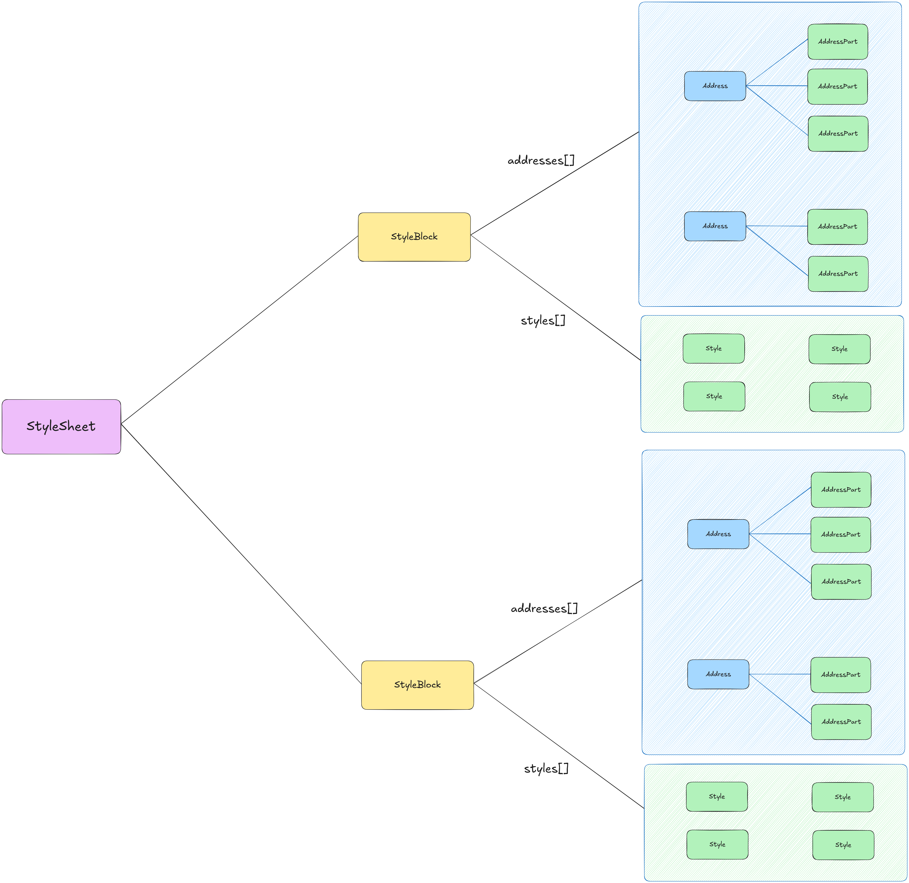
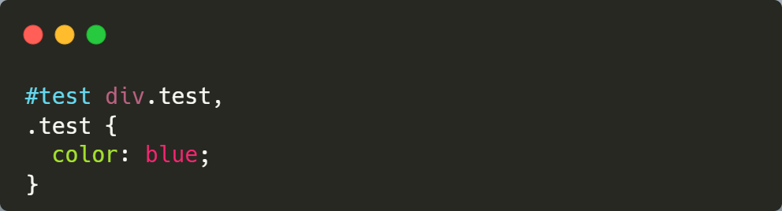
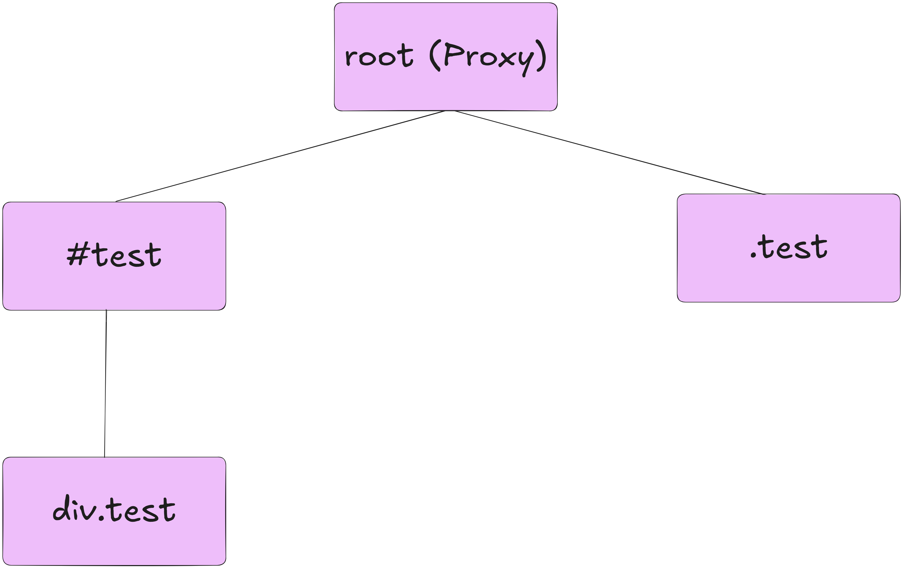

# CSS Lexer

## Problem Statement

CSS is a crucial part of TermRome's rendering engine, used to determine the layout of the page and the styling of elements. This document covers the requirements for TermRome's CSS lexer, along with its design.

## Requirements

1. CSS addresses with multiple parts must be supported.
2. Multiple CSS addresses can share a single style block.
3. Styles should be inherited.
4. Style lookups should be fast (crucial for rendering engine performance).
5. Style conflicts should be resolved by specificity.

## Data Modeling

| Node             | Description                                                                     |
|------------------|---------------------------------------------------------------------------------|
| `StyleSheet`     | Represents a CSS file. Internally contains a tree that is walked during lookup. |
| `StyleBlock`     | Contains info related to a single CSS block.                                    |
| `Address`        | Contains the parts of a selector that make up the full address.                 |
| `AddressPart`    | Represents a single part of selector                                            |
| `Style`          | Contains a single CSS property's info: key and value.                           |

## Lookups

This is the most crucial problem to solve, how fast this is determines whether TermRome feels janky or smooth.

When a `StyleSheet` is created, it resolves the addresses from all of its `StyleBlock`s once, and builds a single tree out of them. This tree is what gets walked during lookups, so no resolution work happens on the hot path. An internal cursor pointer is also maintained to keep track of context. For example, if the last lookup was for a parent, it doesn't make sense to walk from the start back up to that parent, the cursor already points there, and it's used depending on which query is executed.

Consider the following CSS:

This would be represented using the following tree:

The `StyleSheet` would be given the following selectors:

- `#test div.test`
- `.test`

Each node in the tree is an `AddressPart`. An `AddressPart` is responsible for returning a bool for each address part in the query.

> **Note:** This design is subject to change, as it doesn't yet address how styles are merged into a single chunk.

## Merging `[WIP]`

Like lookups, merging is a foundational part of the data model, we need to correctly resolve all selector conflicts and return the resulting styles.

> **Note:** The renderer should not care about how this is computed, and should only receive a list of styles to apply for a given selector.